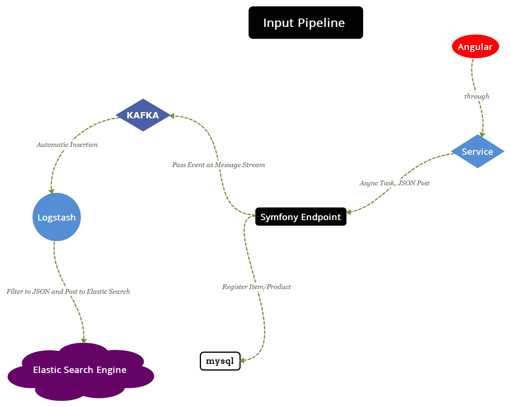
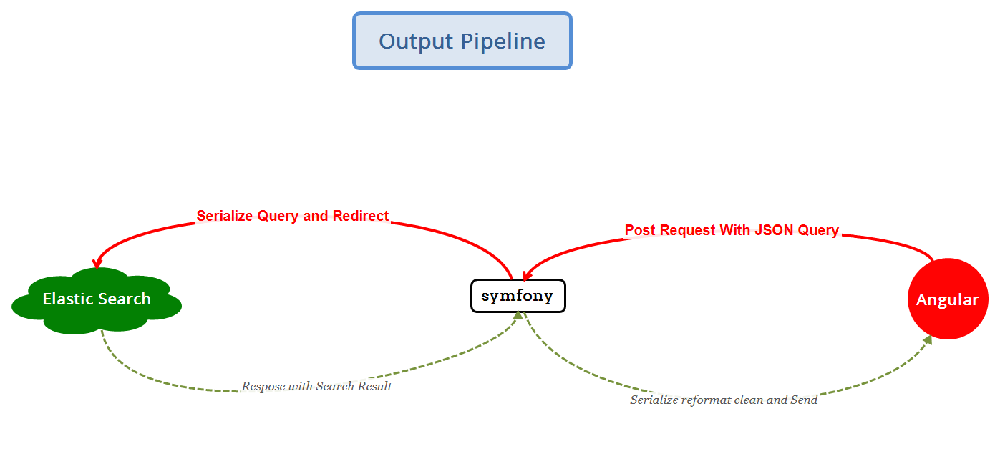

# Full Stack Project

This Project is Created with love and care, mostly. So treat it with respect. 

## Basic Terminology 

The Project Fallows the Charts Represents the workflow pipeline we will use in our project:

### Input Pipeline

### Output Pipeline 

## What need to Be ON While working

1. Elastic Search: For Search u know
2. Kafka Zookeeper 
3. Kafka Server
4. Symfony 4
5. Angular 8
6. MySQL With native password enabled 
7. Logstash Configured with Kibana Input and Elastic Search output (This is Not totally done yet)
8. Kibana for Testing Purposes

## Installation Requirements 

1. Node.JS
2. PHP 7 with `dpo` Extensions enabled
3. MySQL with native password account
4. Elastic Search

## Starting The Project

1. Start Kafka Zookeeper (`see GitHub /Logging-flow/Kafka-cheat-sheet for details`)
2. start Kafka Server (`see GitHub /Logging-flow/Kafka-cheat-sheet for details`)
3. Add Kafka Topic `yes` Manually from the guide i created (`see GitHub /Logging-flow/Kafka-cheat-sheet for details`)

3. start MySQL and Enable native password 
4. start Logstash With the Kafka Config ( `See GitHub /logging-flow/logging-workflow-pipline`)
5. start Elastic Search
6. start Symfony (`see Github product-create-search/crudMysql-sendToKafka`)
7. start Angular (` use --host 192.168.1.x where x is your IP for CROS fix`)
8. install and enable CROS Extension from Chrome Store
9. navigate to `192.168.1.x:4200` and use the Dashboard to Navigate to `Add Painting` 
10. Add Some Paints :) 

## Problems we need to deal with

1. Logstash Needs to have a JSON Filter, which converts Messages to JSON Before Posting it
2. Stability Problems with Kafka, Should be Fixed when moving to AWS... I Hope :)
3. Serialization/Deserialization Should be fixed (Images Problems Accrued from that :( Sorry! )
4. Front End Doesn't Search yet, partly cuz i don't now what i should search for
5. Filtering Returns u to the Dashboard, Don't Know why yet!
6. Very Very Fragmented Documentation which i insist should be dealt with 